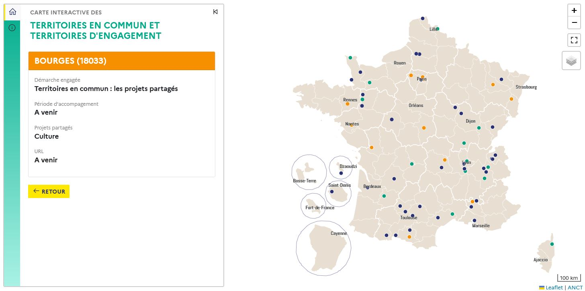

## Carte interactive des territoires de l'engagement citoyen

Page officielle : https://agence-cohesion-territoires.gouv.fr/territoires-dengagement-territoires-en-commun-528 

Lien direct : https://carto.pages.sit.incubateur.tech/engagement-citoyen

## Présentation

La carte interactive des territoires en commun et territoires d'engagement recense les territoires accompagnés par l'ANCT pour construire l'action publique locale avec et par les citoyens, au travers d'une offre de services
matérialisée par trois types de démarches : 
- les projets partagés Territoires en commun 
- les parcours d'accompagement Territoires d'ngagement
- le recours à la cellule de conseil et d'orientation Territoires d'engagement. 

## Fonctionnalités 

- Rechercher, localiser et accéder aux propriétés de chaque territoire (commune, EPCI, PETR ou département) accompagné ;

## Données

Les données seront diffusées sous licence Ouverte Étalab 2.0 sur la page data.gouv de l'ANCT. 

## Technologies

Cet outil, conçu et développé par le service cartographie de l'ANCT, a été réalisé en HTML/CSS/Javascript et utilise les librairies Vue 2.7, Leaflet 1.0.7 et l'extension communautaire Leaflet Sidebar, Bootstrap 5.1.3, Papaparse, Line awesome. Le fond cartographique est issu des fichiers Admin Express COG CARTO de l'IGN ; il a été généralisé par le service cartographie pour un usage adapté au web.

## En savoir plus sur le programme

Sur le site de ANCT : https://agence-cohesion-territoires.gouv.fr/territoires-dengagement-territoires-en-commun-528 
